<!-- LOGO -->
 

    
 <!-- TITULO -->   
  

    Estructura de Datos Taller 2 - Anais Rodriguez
  

<!-- INDICE -->

  
Indice

  <ol>
    <li>
        <a href="#resumen-del-taller">Resumen del Taller</a>
      <ul>
          <li><a href="#consideraciones-extras">Consideraciones Extras</a></li>
      </ul>
    </li>
    <li>
        <a href="#librerías">Librerías</a>
    </li>
    <li>
        <a href="#código">Código</a>
        <ul>
          <li><a href="#main">main</a></li>
          <li><a href="#printheader">printHeader</a></li>
          <li><a href="#printbroad">printBroad</a></li>
          <li><a href="#game">game</a></li>
          <li><a href="#iscolumnfull">isColumnFull</a></li>
          <li><a href="#makemove">makeMove</a></li>
          <li><a href="#undomove">undoMove</a></li>
          <li><a href="#cpumove">cpuMove</a></li>
          <li><a href="#isgameover">isGameOver</a></li>
		  <li><a href="#isgameover">isGameOver</a></li>
		  <li><a href="#minimax">minimax</a></li>
		  <li><a href="#isgameover">isGameOver</a></li>
		  <li><a href="#evaluateposition">evaluatePosition</a></li>
		  <li><a href="#displayMenu">displayMenu</a></li>
		  <li><a href="#validateoption">validateOption</a></li>
		  <li><a href="#validateposition">validatePosition</a></li>
		  <li><a href="#recordwinner">recordWinner</a></li>
		  <li><a href="#recordmatch">recordMatch</a></li>
		  <li><a href="#readparameters">readparameters</a></li>
		  <li><a href="#recordparameters">recordParameters</a></li>
          <li><a href="#valores-definidos">Valores Definidos</a></li>
      </ul>
    </li>
	<li>
        <a href="#análisis-minimax">Análisis Minimax</a>
    </li>
	<li>
        <a href="#análisis-poda">Análisis PODA</a>
    </li>
  </ol>

<!-- RESUMEN DEL TALLER -->
## Resumen del Taller
Se desarrolló el algoritmo para el juego Conecta 4 según los siguientes requerimiento:

* Se debe generar un menú para elegir la dificultad del juego (fácil, medio, difícil).
* Por consola se debe poder visualizar el estado de la partida en el momento (tablero de 6x7).
* Se debe generar un csv que guarde todas las partidas hasta el momento.
* se debe poder ver la puntuación de jugador vs máquina.
* Se debe poder guardar el estado de la partida,y después cargarlo al momento de iniciar el programa.

### Consideraciones Extras
* Se debe incluir en el algoritmo la lógica Minimax
* Se debe implementar PODA
* Se debe analizar el desempeño con y sin PODA

(<a href="#arriba">Ir a Inicio</a>)

# Librerías
Se están utilizando un total de 8 librerías, las cuales se muestran a continuación.

    
    
main.cpp

# Código
A continuación se detallan las funciones usadas en la creación del taller.

## main
Función de tipo `int`, utilizada para mostrar el menú al usuario, el cual está creado en otra función para mantener el orden del código.

    
    
main.cpp

(<a href="#arriba">Ir a Inicio</a>)

## printHeader
Función de tipo `void`, utilizada para mostrar en la interfaz del tablero el nombre de las columnas.
Las columnas están nombras desde la 'A' hasta la 'G' para que haya una diferencia notoria con el resto del tablero.

    
    
board.c

(<a href="#arriba">Ir a Inicio</a>)

## printBoard

Función de tipo `int`, utilizada para mostrar en la interfaz el tablero, el cual se va actualizando con cada jugada que se realizan.
Las dimensiones del tablero pueden ser modificadas en los parámetros del algoritmo. 

    
    
board.c

(<a href="#arriba">Ir a Inicio</a>)

## game

Función de tipo `int`, donde se invoca toda la lógica del juego: 

* Movimientos
* Puntuación
* Minimax y PODA

    
    
game.c

(<a href="#arriba">Ir a Inicio</a>)

## isColumnFull

Función de tipo `int`, utilizada para evaluar si la posición ingresada por ambos jugadores pertenece a una columna que se encuentra llena. 

    
    
moves.c

(<a href="#arriba">Ir a Inicio</a>)

## makeMove

Función de tipo `void`, utilizada para colocar en el tablero la ficha correspondiende a cada jugador dependiendo de la posición que ingresaron. 

    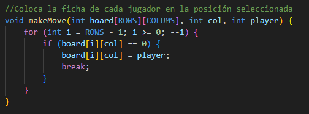
    
moves.c

(<a href="#arriba">Ir a Inicio</a>)

## undoMove

Función de tipo `void`, utilizada para permitirle a la CPU modificar su jugada por una más conveniente según su constante evaluación de nodos. 

    
    
moves.cpp

(<a href="#arriba">Ir a Inicio</a>)

## cpuMove

Función de tipo `int`, utilizada para evaluar la jugada de la CPU aplicando Minimax y PODA.

    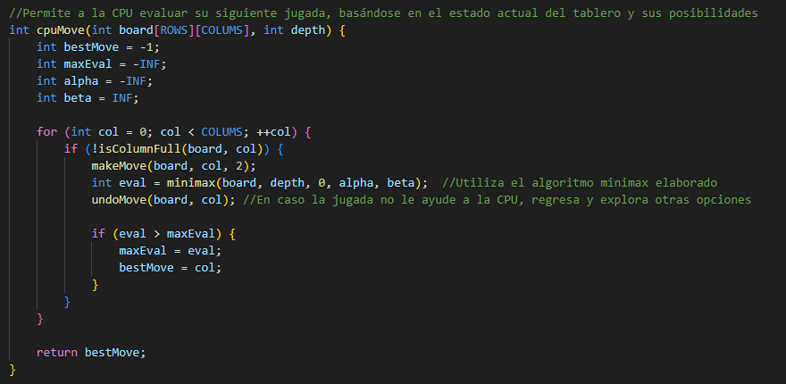
    
moves.cpp

(<a href="#arriba">Ir a Inicio</a>)

## isGameOver

Función de tipo `int`, utilizada para revisar el resultado del juego por cada jugador o si fue un empate. 

* Verificación de arriba a abajo
* Verififcación en diagonales
* Juego aún en cursp
* Empate

    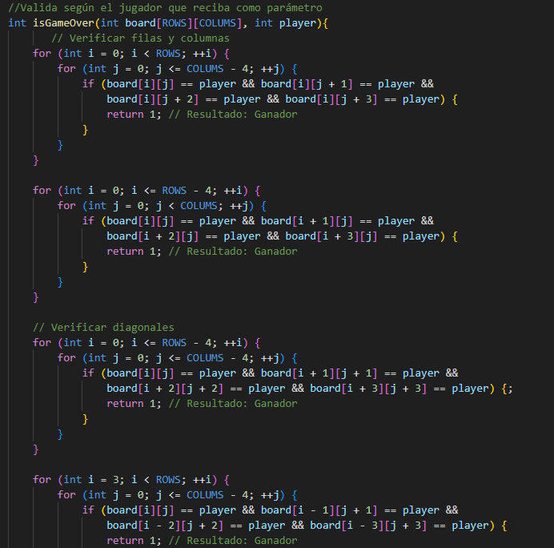
    
scores.c

(<a href="#arriba">Ir a Inicio</a>)

## minimax

Función de tipo `int`, utilizada por la CPU para la evaluación de nodos en función de Alpha y Beta, en base a los resultados toma el resultado que mejor le convenga.
Se incluye también la PODA para optimización análisis de nodos. 

    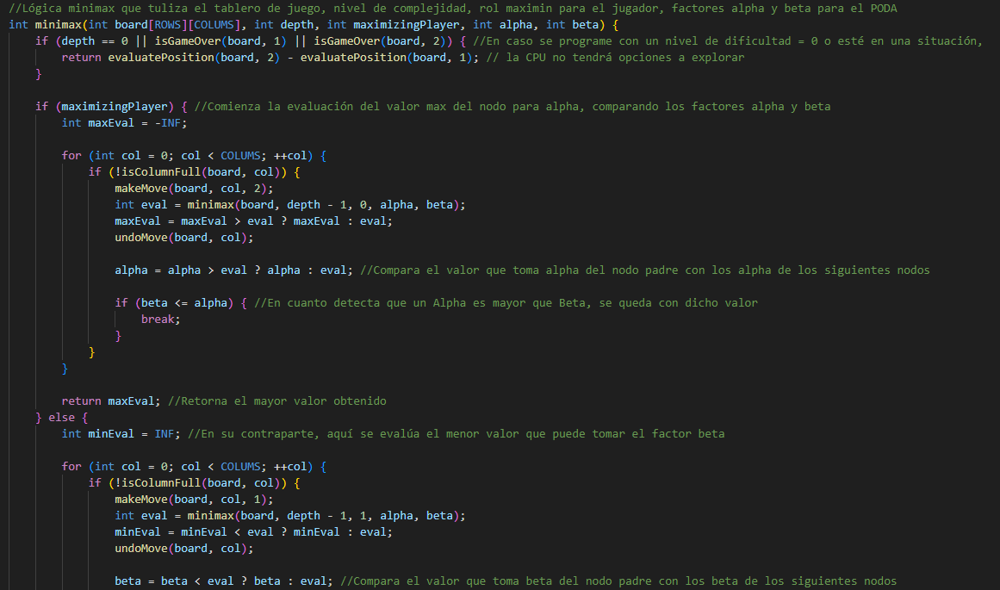
    
minimax.c

(<a href="#arriba">Ir a Inicio</a>)

## evaluatePosition

Función de tipo `int`, utilizada por la CPU para la evaluación del estado del tablero, haciendo uso de puntajes para determinar que jugador está más cerca de ganar. 

    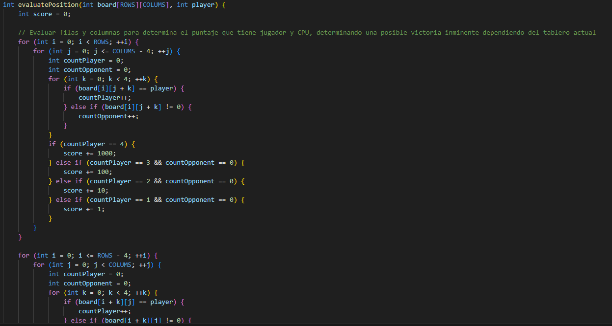
    
minimax.c

(<a href="#arriba">Ir a Inicio</a>)

### Funciones adicionales

Para complementar la lógica de: Conteo de victorias, Partidas jugadas, Registro de partidas; se crearon diversas funciones que están incluídas dentro de addons.c ya que como su nombre lo indica, funcionan como adicionales a la lógica principal del taller
y nos ayuda a mantener un mejor orden del código.

## displayMenu

Función de tipo `int`, donde se establece la lógica de un menú recursivo que le permita al usuario jugar las veces que guste y en las dificultades que prefiera. 

    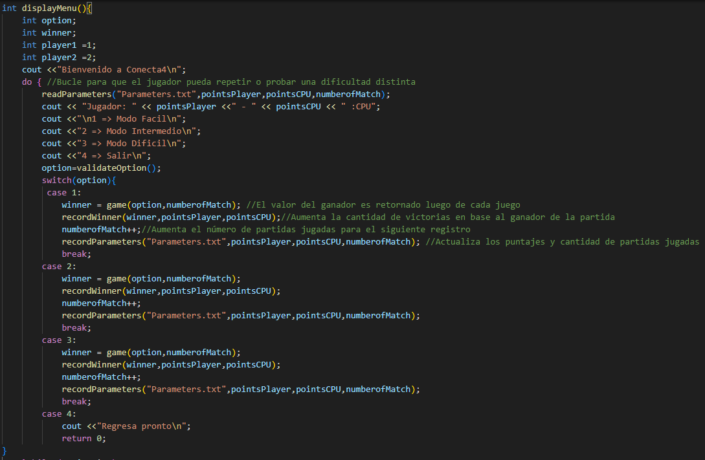
    
addons.c

(<a href="#arriba">Ir a Inicio</a>)

## validateOption

Función de tipo `int`, que ayuda a validar que la opción de dificultad ingresada sea de un valor permitido. 

    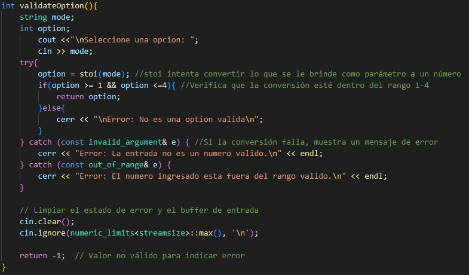
    
addons.c

(<a href="#arriba">Ir a Inicio</a>)

## validatePosition

Función de tipo `int`, que ayuda a validar que la posición ingresada sea de un valor permitido. 

    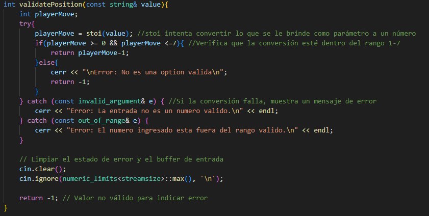
    
addons.c

(<a href="#arriba">Ir a Inicio</a>)

## recordWinner

Función de tipo `int`, que aumenta la cantidad de victorias del ganador en cada partida. 

    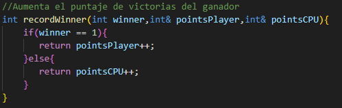
    
addons.c

(<a href="#arriba">Ir a Inicio</a>)

## recordMatch

Función de tipo `void`, que registra en un archivo CSV la número de partida, ganador, dificultad y el tablero de la partida. 

    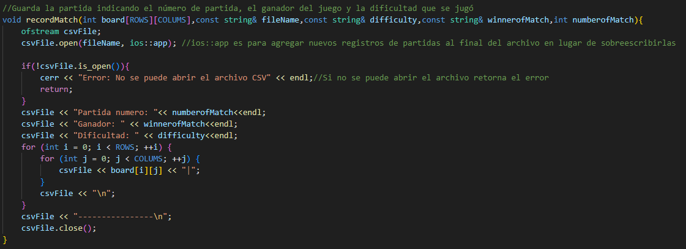
    
addons.c

(<a href="#arriba">Ir a Inicio</a>)

## readParameters

Función de tipo `int`, que permite leer un archivo que contiene el número actualizado de partidas jugadas y victorias por cada jugador, de esta manera el programa siempre muestra los valores actualizados cada día. En la primera ejecución del programa se creará dicho archivo.

    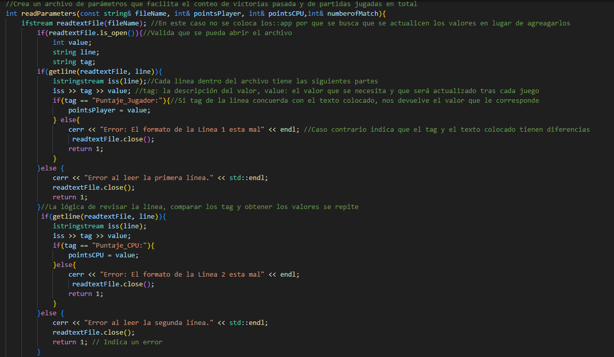
    
addons.c

(<a href="#arriba">Ir a Inicio</a>)

## recordParameters

Función de tipo `void`, que permite actualizar los valores de partidas jugadas y victorias dentro del archivo, también funciona como creación del archivo durante la primera ejecución del programa.

    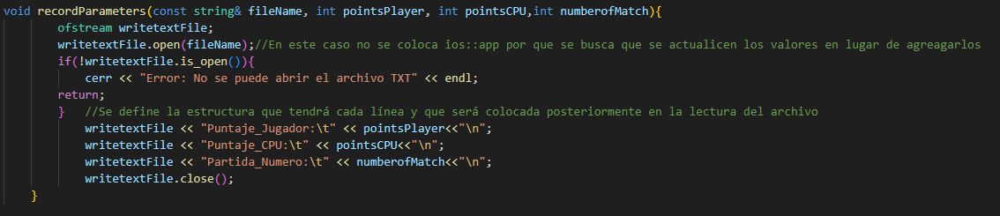
    
addons.c

(<a href="#arriba">Ir a Inicio</a>)

### Valores definidos

Permite la modificación sobre el tamaño del tablero.

    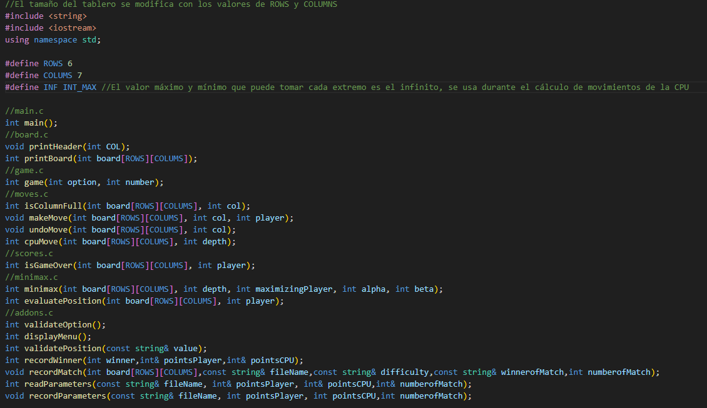
    
values.h

	

(<a href="#arriba">Ir a Inicio</a>)

### Análisis Minimax

Como parte de las consideraciones del taller, se implementó la lógica Minimax para hacer que la CPU evalúe los posibles escenarios 
para ganar y de esa manera seleccione la mejor posición para colocar su ficha. 

Dentro de las pruebas realizadas durante el desarrollo, se evidenció que mientras más alto el nivel de profundidad, la CPU es capaz de evaluar más escenarios
lo cual se vió reflejado en sus decisiónes tomadas, a diferencia de un nivel de profundidad bajo donde colocaba las fichas en lugares que no suponían un reto
para el jugador.

Sin embargo el hecho de tener un nivel de profundidad alto, implica que debe pasar por todos los escenarios posibles aunque estos no la lleven necesariamente
a uno en donde salga vencedora pero eso se soluciona en el siguiente punto: PODA de Alpha y Beta.

El tener que evaluar cada escenario posible impacta directamente en el tiempo que demora la CPU para tomar una decisón, esto también se ve afectado por el tipo de juego: Un 3 en raya con un tablero de 3x3
tiene menos escenarios posibles que un Conecta 4 con un tablero de 6x7.

Elaborar un boceto del árbol de decisiones sirve como guía visual para entender el comportamiento que tiene la lógica Minimax,

    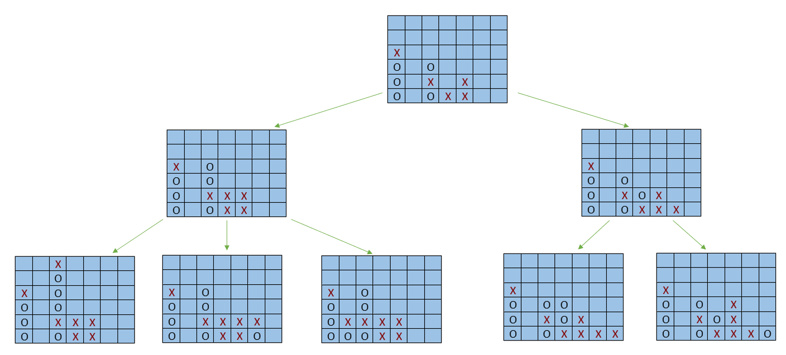
    
Ejemplo reducido

"El arbol usado como ejemplo no representa todas las decisiones posibles, sirve como una representación de los escenarios que evalúa la CPU para decidir su jugada"

(<a href="#arriba">Ir a Inicio</a>)

### Análisis PODA

Para evitar que la lógica Minimax tome demasiado tiempo (esto resultó muy útil en los tableros de dimensiones grandes por que se generan más escenarios a diferencia de uno pequeño) esto
se debe a que la PODA de Alpha y Beta aprovecha la búsqueda de valores máximos o mínimos, en caso encuentre uno que se adecua a la regla planteada, poda los demás nodos (de ahí viene el significado del nombre)
y evita seguir evaluando el resto de nodos.

En base a las comparativas dentro de la lógica, la diferencia entre aplicar o no PODA resulta notoria al momento de esperar una respuesta por parte de la CPU al momento de aplicar un nivel de profundida alto (esto se aplica en la dificultad dificil o modificable manualmente dentro del código).

(<a href="#arriba">Ir a Inicio</a>)
